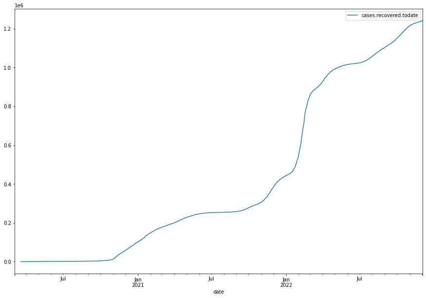

Import pandas and load data from CSV file:


```python
import pandas as pd

df = pd.read_csv('https://raw.githubusercontent.com/sledilnik/data/master/csv/cases.csv', parse_dates=['date'])
```

Check columns in dataframe


```python
df.info()
```

    <class 'pandas.core.frame.DataFrame'>
    RangeIndex: 1005 entries, 0 to 1004
    Data columns (total 10 columns):
     #   Column                              Non-Null Count  Dtype         
    ---  ------                              --------------  -----         
     0   date                                1005 non-null   datetime64[ns]
     1   cases.confirmed                     989 non-null    float64       
     2   cases.confirmed.todate              1005 non-null   int64         
     3   cases.active                        992 non-null    float64       
     4   cases.closed.todate                 991 non-null    float64       
     5   cases.recovered.todate              990 non-null    float64       
     6   cases.rh.occupant.confirmed.todate  996 non-null    float64       
     7   cases.hs.employee.confirmed.todate  224 non-null    float64       
     8   cases.rh.employee.confirmed.todate  221 non-null    float64       
     9   cases.vaccinated.confirmed.todate   351 non-null    float64       
    dtypes: datetime64[ns](1), float64(8), int64(1)
    memory usage: 78.6 KB


Inspect data


```python
df.head()
```


<div>
<style scoped>
    .dataframe tbody tr th:only-of-type {
        vertical-align: middle;
    }

    .dataframe tbody tr th {
        vertical-align: top;
    }

    .dataframe thead th {
        text-align: right;
    }
</style>
<table border="1" class="dataframe">
  <thead>
    <tr style="text-align: right;">
      <th></th>
      <th>date</th>
      <th>cases.confirmed</th>
      <th>cases.confirmed.todate</th>
      <th>cases.active</th>
      <th>cases.closed.todate</th>
      <th>cases.recovered.todate</th>
      <th>cases.rh.occupant.confirmed.todate</th>
      <th>cases.hs.employee.confirmed.todate</th>
      <th>cases.rh.employee.confirmed.todate</th>
      <th>cases.vaccinated.confirmed.todate</th>
    </tr>
  </thead>
  <tbody>
    <tr>
      <th>0</th>
      <td>2020-03-04</td>
      <td>1.0</td>
      <td>1</td>
      <td>NaN</td>
      <td>NaN</td>
      <td>NaN</td>
      <td>NaN</td>
      <td>NaN</td>
      <td>NaN</td>
      <td>NaN</td>
    </tr>
    <tr>
      <th>1</th>
      <td>2020-03-05</td>
      <td>5.0</td>
      <td>6</td>
      <td>NaN</td>
      <td>NaN</td>
      <td>NaN</td>
      <td>NaN</td>
      <td>1.0</td>
      <td>NaN</td>
      <td>NaN</td>
    </tr>
    <tr>
      <th>2</th>
      <td>2020-03-06</td>
      <td>4.0</td>
      <td>10</td>
      <td>NaN</td>
      <td>NaN</td>
      <td>NaN</td>
      <td>NaN</td>
      <td>3.0</td>
      <td>NaN</td>
      <td>NaN</td>
    </tr>
    <tr>
      <th>3</th>
      <td>2020-03-07</td>
      <td>5.0</td>
      <td>15</td>
      <td>NaN</td>
      <td>NaN</td>
      <td>NaN</td>
      <td>NaN</td>
      <td>3.0</td>
      <td>NaN</td>
      <td>NaN</td>
    </tr>
    <tr>
      <th>4</th>
      <td>2020-03-08</td>
      <td>5.0</td>
      <td>20</td>
      <td>NaN</td>
      <td>NaN</td>
      <td>NaN</td>
      <td>NaN</td>
      <td>5.0</td>
      <td>1.0</td>
      <td>NaN</td>
    </tr>
  </tbody>
</table>
</div>


Plot something :)


```python
df.plot(x='date', y='cases.recovered.todate', figsize=(15, 10))
```


    <AxesSubplot:xlabel='date'>


    

    

